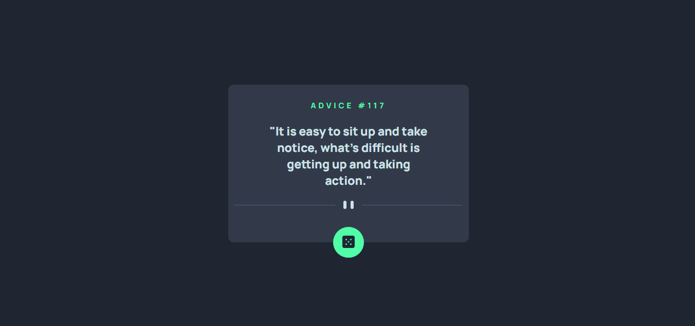
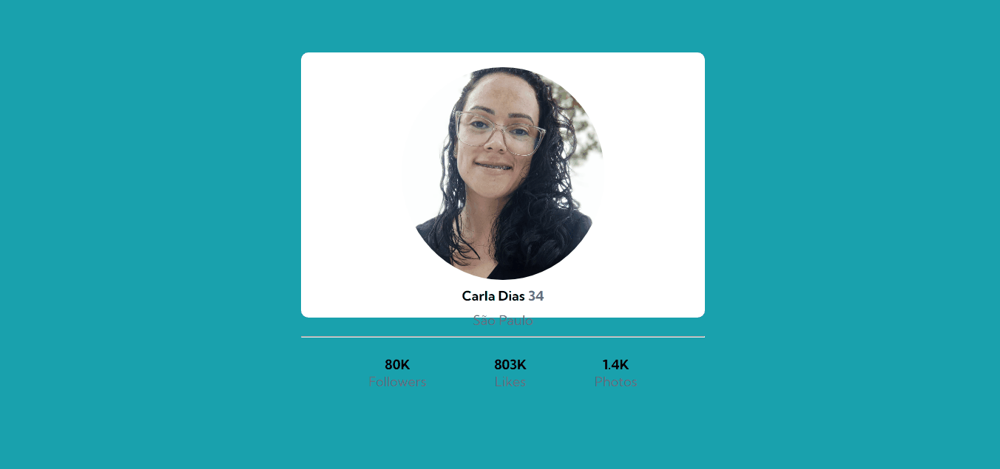
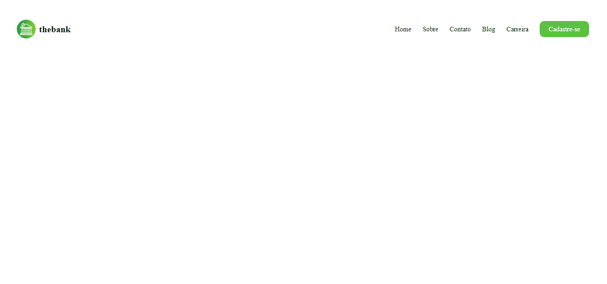
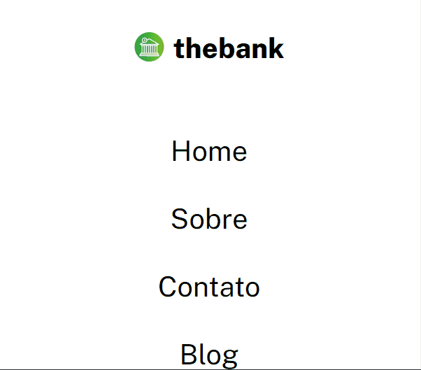
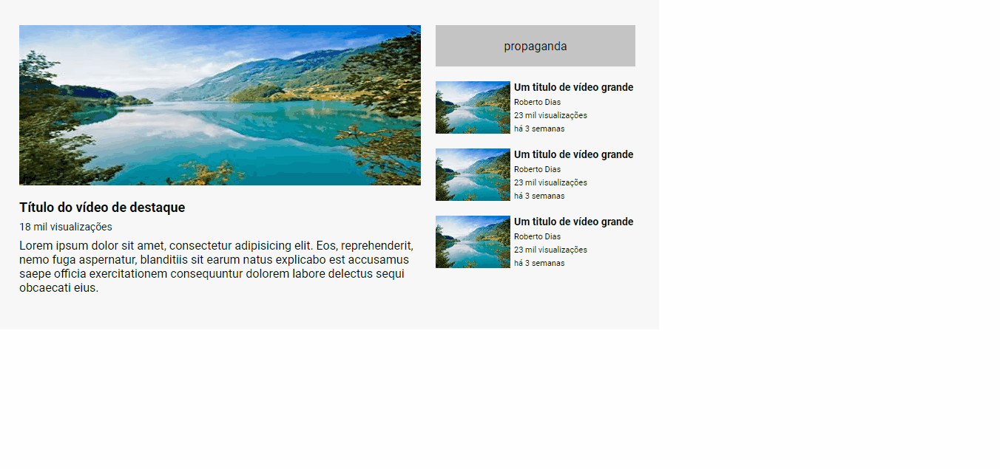

### Exercícios em HTML e CSS
## Descrição
Alguns exercícios desenvolvidos durante o curso DevQuest para desenvolver conhecimentos e habilidades conquistadas durante o curso.
## Páginas desenvolvidas:

### - App Gerador de Conselhos:

Requisítos: utilizar Flexbox.

### - Cartão perfil:

Requisítos: utiizar Flexbox.

### - Menu - thebank:

Requisítos: responsividade e Flexbox.

### - Menu - thebank mobile:

Requisítos: responsividade e Flexbox.

Foi desenvolvido primeiro a versão mobile para depois desenvolver a desktop.

### - Site estilo YouTube.

Requisítos: Utilizar grid.

### Técnologias utilizadas
- HTML
- CSS
